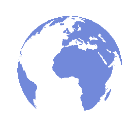
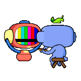
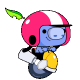

# Subhadeep Pramanik 

#  Hello world 

  <em>
    I am a Second Year undergraduate Computer Science Student.  
    19 years of living a comical life!  
    <b>I am currently exploring more about various JS liabraries</b>  and <b> also trying my hands on Backend Devlopment.</b>&nbsp
      
    Building Applications is fun. I love building services that power the future of web.
    I Love <b>Video Editing</b> as well, xD.  
  </em>  

 

-  Visit My portfolio Website At: <a href="https://i.pinimg.com/originals/bf/45/72/bf45724399d8ab9aa70a633c0555a97d.gif"><b>Coming Soon 😅 </b></a>.
-  I’m **good** in **Web Development** With **HTML**,**CSS** or **React**❤️.
-  Currently Learning **React** and working on improving my **Data Structures** and **Algorithm** skills👨‍💻.
-  I love making Creative Projects👨‍💻.
-   2021 Goals: 1. Contribute more to Open Source Projects 🏆   2. Become a Full stack Developer.
-  I’m *open for collaboration*🧠 on **Any kind of projects**.
- What is the best way to contact me? [Linkedin](https://www.linkedin.com/in/chirag-kumar-sharma-5286b51b8)
-  I love Building communities on Discord.
-  Have a look at my Repos💡 & do Leave a **STAR**⭐️ if you like my work👨‍💻.
   

### Spotify Playing 🎧

<!--  -->

---
## Languages and Tools:

    

---

## Connect with me:

  <a href="https://discord.gg/Fb2yJHD6aA">
    
   &nbsp;&nbsp;
   &nbsp;&nbsp;
   &nbsp;&nbsp;
  

  
<b>✨✨✨✨✨✨✨✨✨✨✨✨✨Thank You-🙏🏼✨✨✨✨✨✨✨✨✨✨✨✨✨</b>

